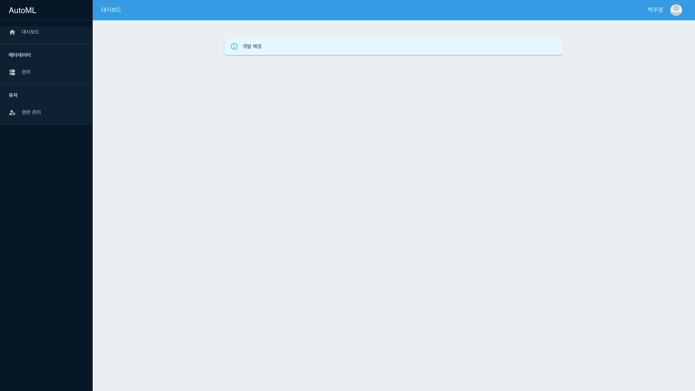
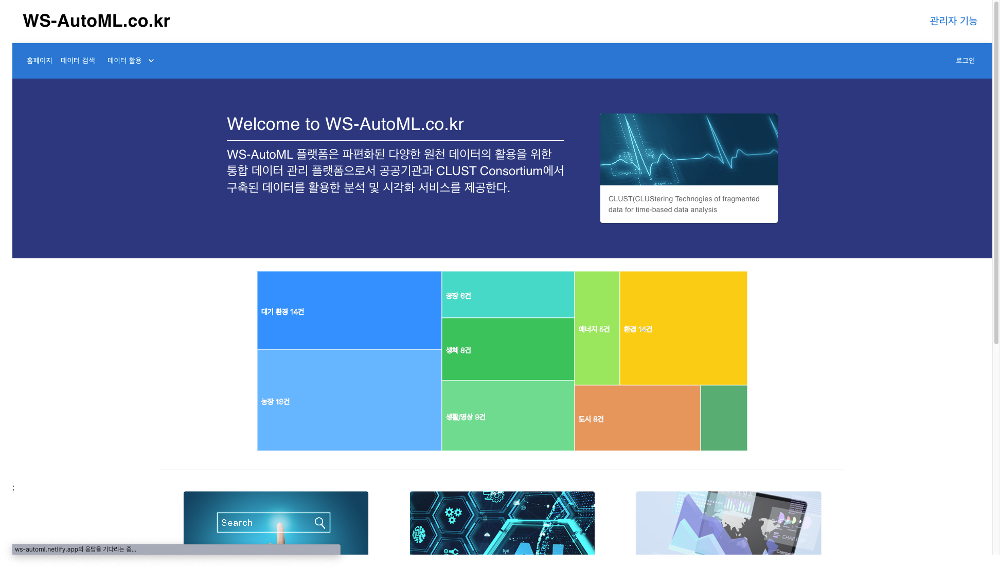

# AutoMLMainWeb

### 소개

AutoML은 날씨, 교통 관련 오픈 데이터를 제공하는 오픈 데이터 웹 플랫폼입니다.

### 사진

어드민 서비스 메인 페이지

사용자 서비스 메인 페이지

- (2022.08.01) 현재 사용자 서비스는 서버는 존재하지 않고 웹으로만 구성되어 있습니다. [링크](https://ws-automl.netlify.app/)

### 주요 기술

웹

- React, Material UI

서버

- Java17, JUnit5
- Spring Boot, Spring Web MVC
- Spring Security, OAuth 2.0(google)
- Spring Data JPA, MariaDB, QueryDSL, Flyway, H2
- Spring Rest Docs

인프라

- Amazon RDS
- Amazon S3
- Docker, AWS ECS(EC2)
- GitHub Actions

### 기타

- [문서 목록](./docs)
