# AutoMLMainWeb

### 소개

---

WS-AutoML은 클라우드 기반의 시계열 데이터 활용을 위한 오픈 데이터 제공 및 모델 학습·활용 서비스를 제공하는 통합 데이터 관리 플랫폼입니다.

- 관리자 서비스 메인 페이지
  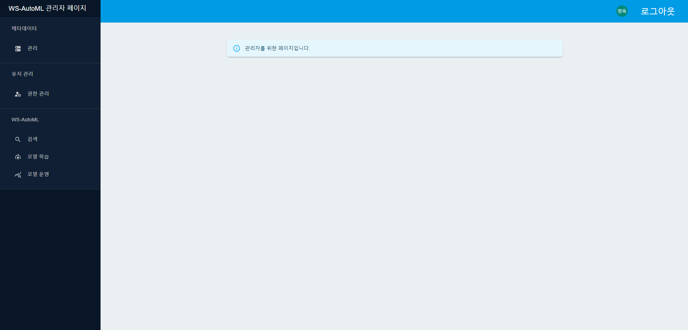

- 사용자 서비스 메인 페이지
  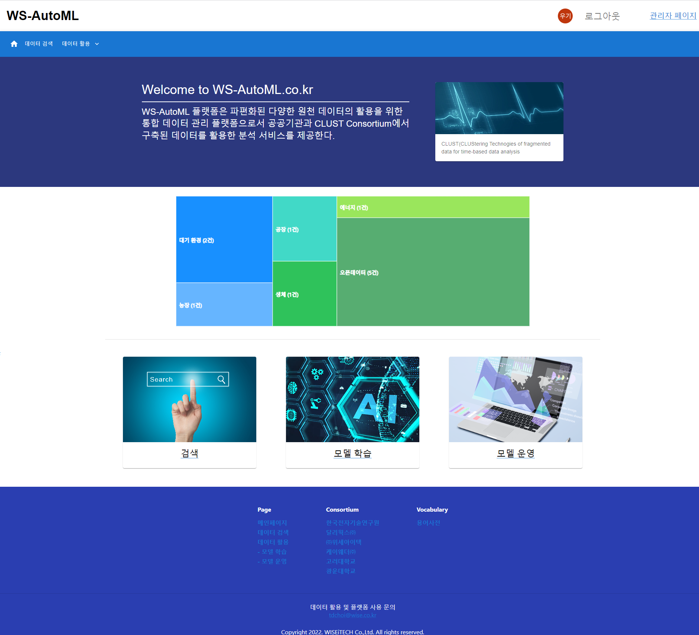

### 주요 기능

---

- **관리자**

  **1) 메타데이터 관리**

  - 메타데이터 리스트
    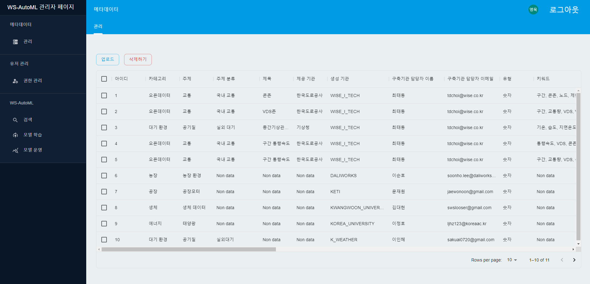
  - 메타데이터 업로드
    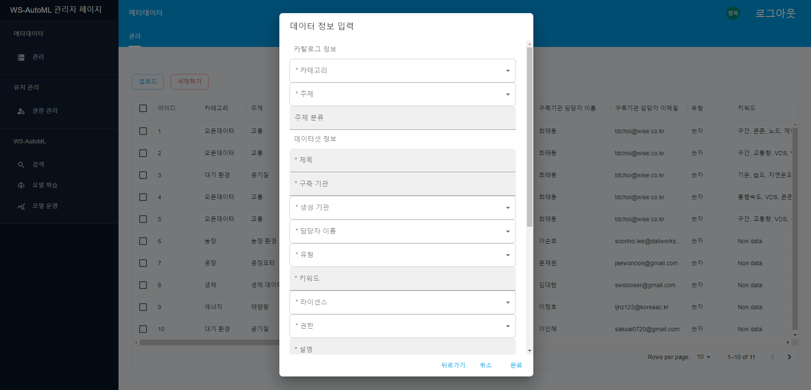

  **2) 사용자 권한 관리**
  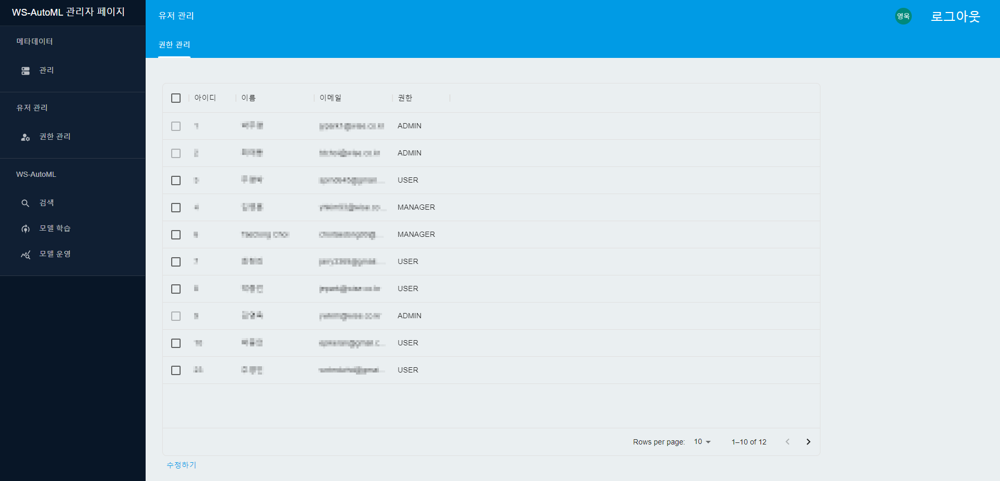

- **사용자**

  **1) 메타데이터 검색 및 조회**

  - 메타데이터 검색
    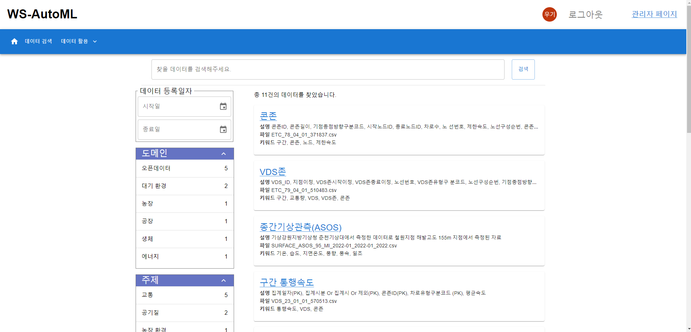

  - 메타데이터 조회 및 파일 미리보기·다운로드
    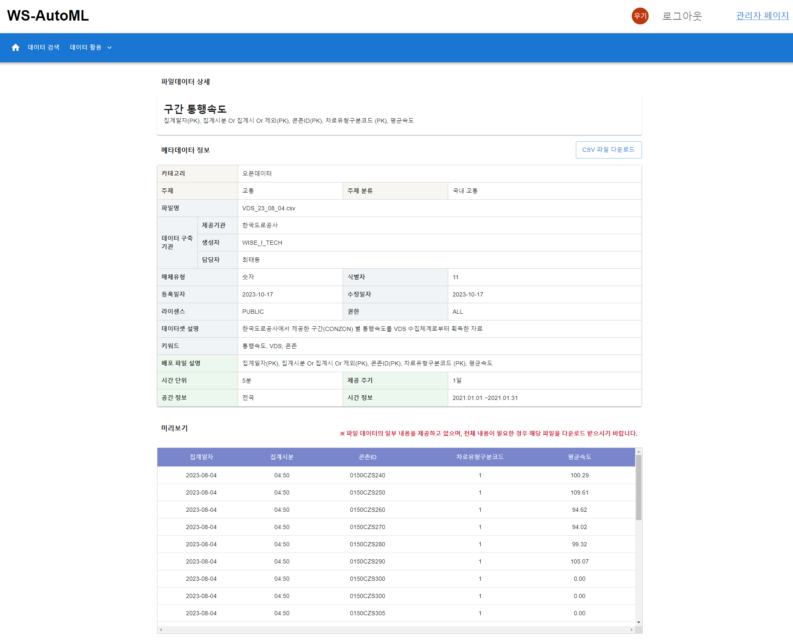

  **2) 사용자별 모델 운용(모델 학습, 모델 활용)**

  - 모델 학습

    - 사용할 데이터셋 선택
      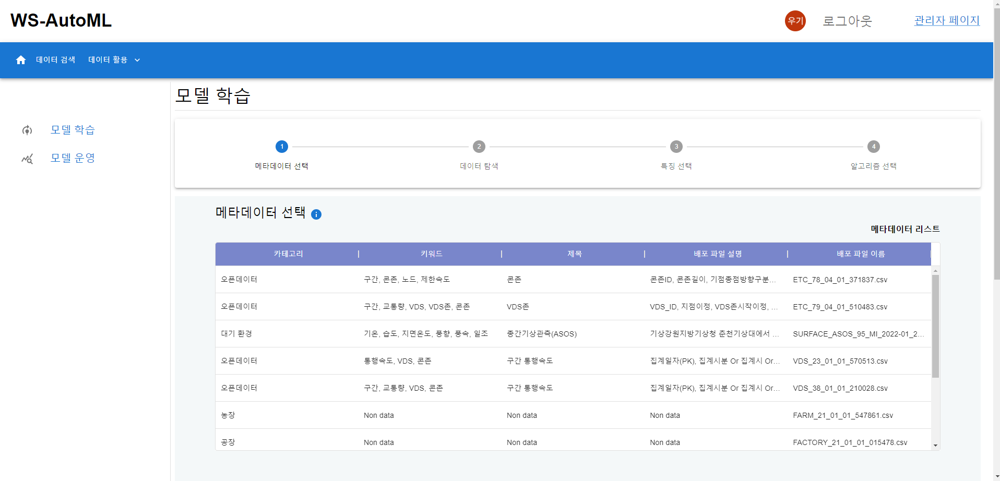
    - 데이터 탐색 및 목표 변수 선택
      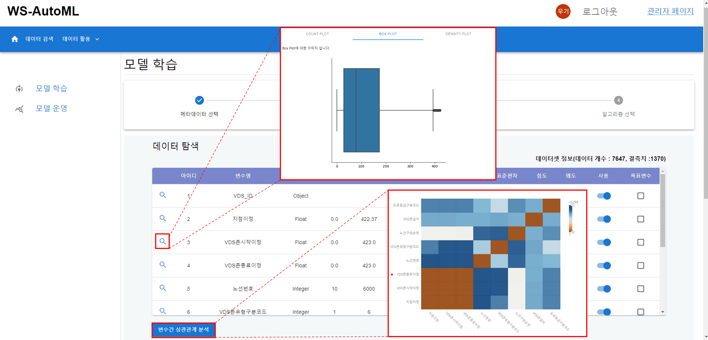
    - 특징 중요도에 따른 사용 변수 선택
      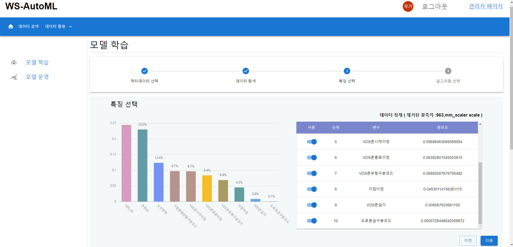
    - 알고리즘 선택 및 파라미터 설정 후 모델 생성
      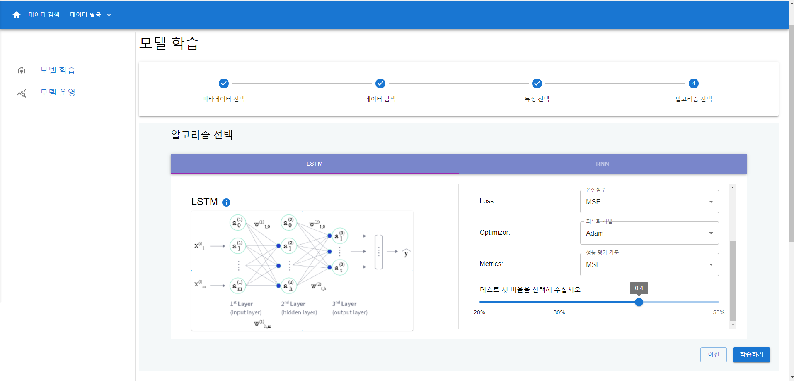

  - 모델 운영
    

    - 모델 활용(데이터 보간 및 예측)
      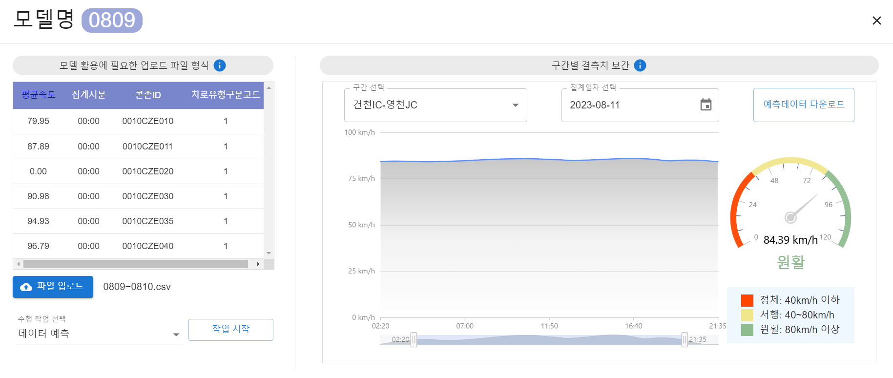

### 주요 기술

---

웹

- React, Material UI, Ant Design

서버

- Java17, JUnit5
- Spring Boot, Spring Web MVC
- Spring Security, OAuth 2.0(google)
- Spring Data JPA, MariaDB, QueryDSL, Flyway, H2
- Spring Rest Docs

인프라

- Amazon RDS(MariaDB)
- Amazon S3
- Docker, AWS ECS(EC2)
- GitHub Actions

분석

- Python
- SQL

데이터

- 고속도로 한국도로교통공사
- 케이웨더

### 기타

---

- [문서 목록](./docs)
