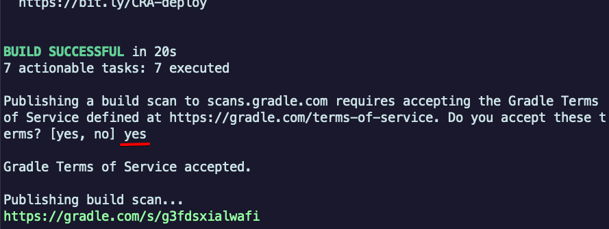
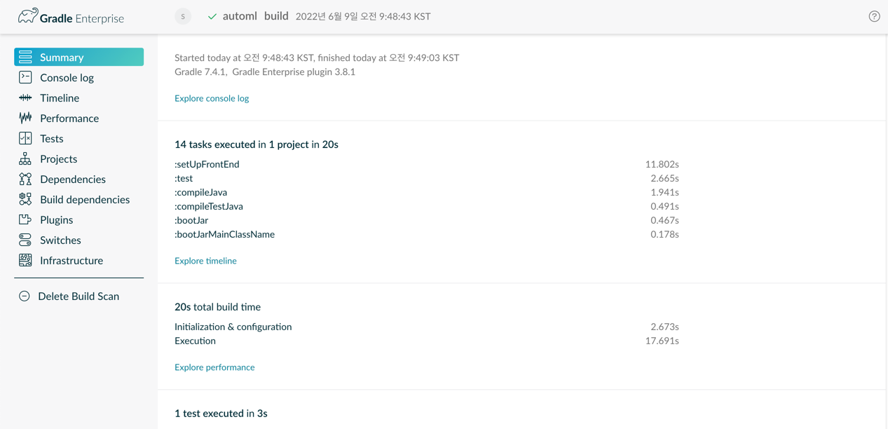

# Gradle 빌드 속도 개선

### 빌드 전 node 다운로드

`gradle-node-plugin`을 통해 node로 웹을 빌드하고 복사하는 과정이 포함되어 있습니다.

여기서 download 옵션을 `fasle`로
설정하였습니다. [github 문서](https://github.com/node-gradle/gradle-node-plugin/blob/master/docs/usage.md#configuring-the-plugin)
에서 해당 옵션 스펙을 보면

```groovy
node {
    // Whether to download and install a specific Node.js version or not
    // If false, it will use the globally installed Node.js
    // If true, it will download node using above parameters
    // Note that npm is bundled with Node.js
    download = false
}
```

> If false, it will use the globally installed Node.js
> (false로 설정될 경우 글로벌로 설정된 Node.js를 사용합니다.)

매번 node를 다운로드 하지 않고 node 명령어를 사용하기 위해 gradle build전 node 설치 과정을 추가했습니다.

```yaml
- name: Node 설치 # 여기
  uses: actions/setup-node@v3
  with:
    node-version: 16.14.0
- name: Gradle 초기화
  run: |
    ./gradlew clean
- name: Gradle 빌드
  run: |
    ./gradlew build --exclude-task test --scan --no-daemon
```

### cache 옵션 활성화

gradle은 `.gradle`이라는 폴더 내에 정보를 캐싱합니다.

자바 설치 actions에서도 이를 쉽게 사용할 수 있도록 옵션을 제공하고 있습니다.

```yaml
- name: Set up JDK 17
    uses: actions/setup-java@v3
    with:
      java-version: '17'
      distribution: 'corretto'
      cache: gradle # 여기
```

### --no-daemon 옵션 추가

github actions에서 항상 gradle 데몬이 띄워져 있는 것을 보장하지 않기 때문에 해당 옵션을
추가합니다. [관련 글](https://tomgregory.com/build-gradle-projects-with-github-actions/#6_Use_gradle-build-action:~:text=The%20GitHub%20documentation%20says%20Ensure%20no%20Gradle%20daemons%20are%20running%20anymore%20when%20your%20workflow%20completes.%20Creating%20the%20cache%20package%20might%20fail%20due%20to%20locks%20being%20held%20by%20Gradle.%20For%20this%20reason%2C%20it%E2%80%99s%20a%20good%20idea%20to%20run%20your%20build%20with%20the%20%2D%2Dno%2Ddaemon%20flag%20i.e.%20./gradlew%20build%20%2D%2Dno%2Ddaemon.)

```bash
./gradlew build --no-daemon
```

### 비고: --scan 옵션

```Bash
./gradlew build --scan
```

커맨드라인에서 yes를 입력 (Gradle 4.3 버전 이상만 해당)


gradle 빌드 시간 등에 대해 분석할 수 있는 사이트 제공



## See Also:

사용한 actions

- https://github.com/actions/setup-java
- https://github.com/actions/setup-node

Gradle Build Scan
- https://scans.gradle.com/
