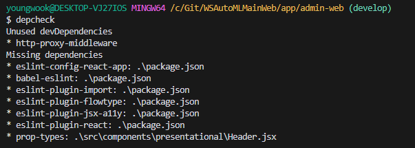
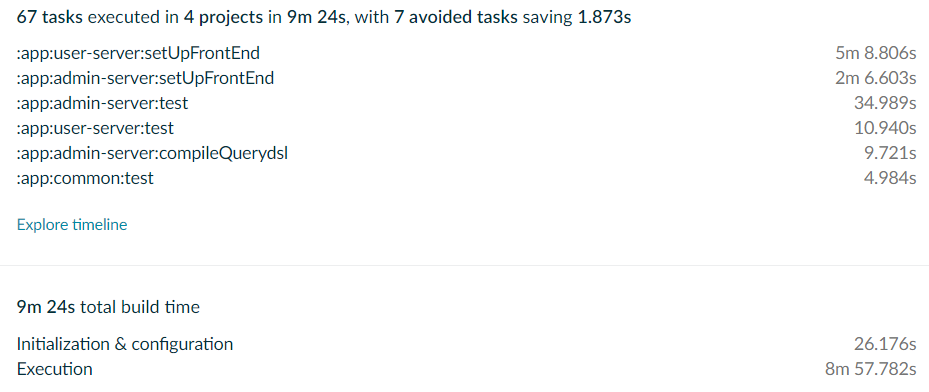
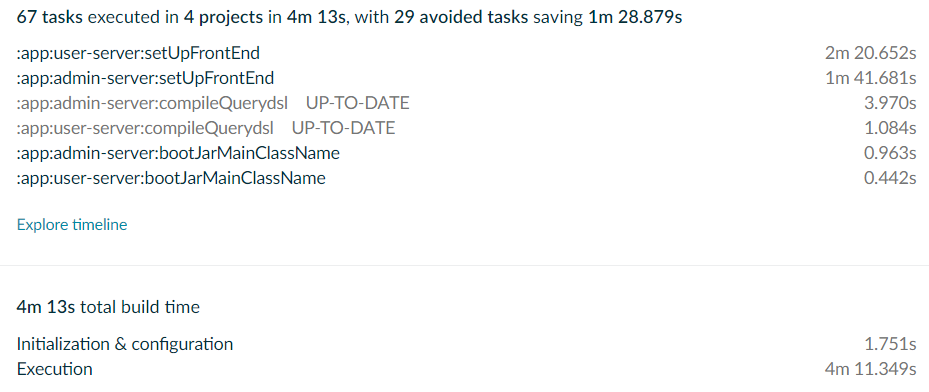
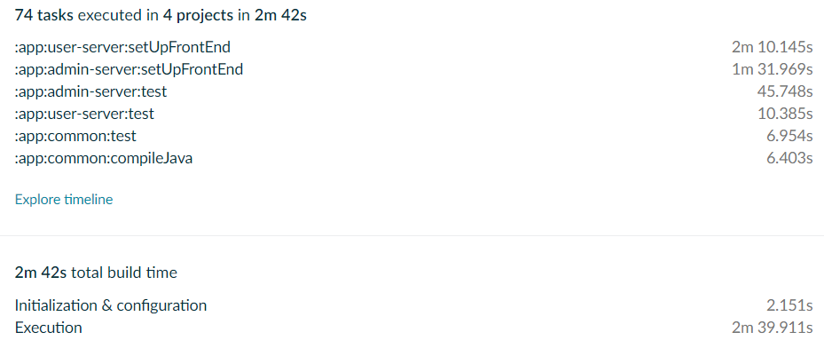

# Npm 빌드 속도 개선

해당 글은 npm build 과정의 속도를 개선하고자 작성합니다.

### 1. Depcheck

---

- Depcheck을 이용하여 unused npm packages를 찾고 불필요한 dependencies을 제거할 수 있습니다.
  - Depcheck 설치

```Bash
npm install -g depcheck
```

- 해당 package.json이 있는 디렉토리로 이동하여 아래의 명령어를 입력합니다.

```Bash
depcheck
```

- 확인된 Unused dependencies를 package.json에서 의존성을 삭제합니다.
  

### 2. Parallel

---

- gradle의 --parallel 옵션 : 병렬 실행을 가능하게 하는 옵션으로 프로젝트가 많을 수록 성능 향상 폭이 커지게 됩니다.

```Bash
./gradlew build --parallel
```

- 해당 프로젝트는 build.gradle을 통해 프론트앤드를 서빙하기 때문에 gradle을 이용해 위 옵션을 사용합니다.

### 3. ESBuild-loader

---

- 해당 기능은 webpack 버전 충돌로 인해 미적용(필요 시 적용 재시도)

### Gradle Build Scan을 이용한 빌드 속도 분석 및 비교

---

- https://scans.gradle.com/

1. 처리 이전 빌드 속도
   

2. Depcheck로 불필요한 dependencies 제거
   

3. Depcheck + Parallel옵션 적용
   

### 참고 문서

---

Depcheck:

- https://www.npmjs.com/package/depcheck
- https://all-dev-kang.tistory.com/entry/%EA%B0%9C%EB%B0%9C%ED%99%98%EA%B2%BD-packagejson-%EB%8B%A4%EC%9D%B4%EC%96%B4%ED%8A%B8-%EC%97%AC%EC%A0%95%EA%B8%B0-depcheck-npm-check

Parallel:

- https://docs.gradle.org/current/userguide/performance.html
- https://ryumodrn.tistory.com/18

ESBuild-loader:

- https://github.com/privatenumber/esbuild-loader
- https://www.npmjs.com/package/esbuild-loader
