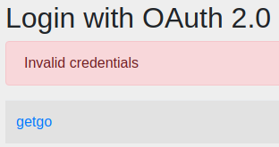
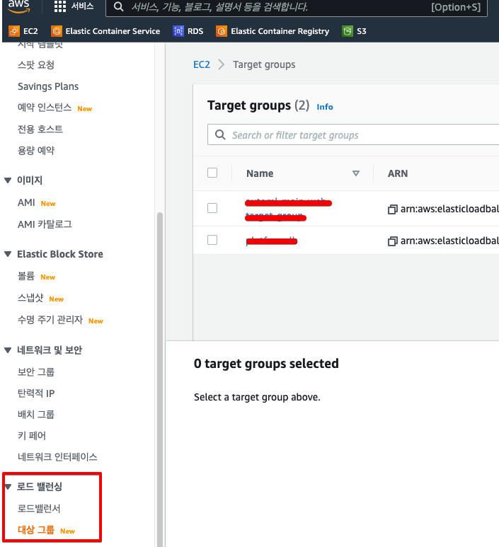
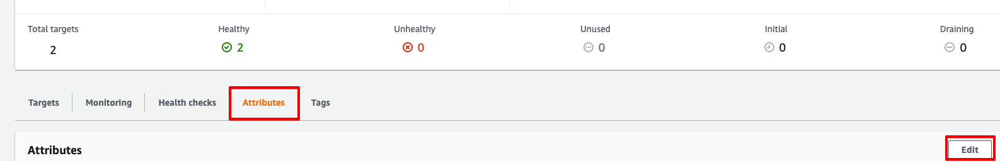
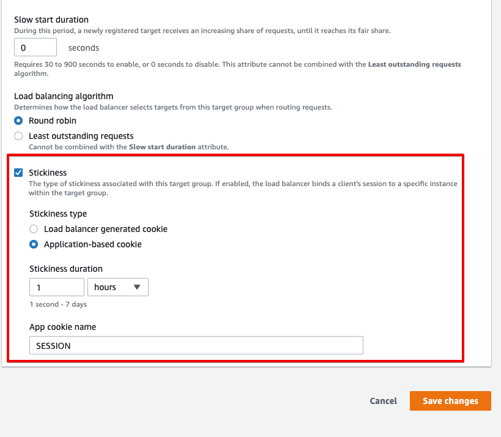

# Stickey Session

작성일: `2022.08.01`

### Note

`2022.08.01` 기준 세션 저장소를 h2 DB나 톰캣 세션이 아닌 RDBMS를 사용하기 때문에 해당하지 않는 내용입니다.

### 개요

컨테이너 개수를 늘려야 할 일이 있어, 증설 후 oauth2로 구글 로그인을 하려던 중 `invalid credentials`라는 에러가 발생하였습니다.

해당 에러를 해결하기 위해 도입하였던 Stickey Session에 대해 알아봅시다.

### Stickey Session이란?

현재 ECS로 구성한 인프라에는 Stickey Session이 적용되어 있습니다.

Stickey Session이란 **특정 세션의 요청을 처음 처리한 서버에만 적용하는 것**을 의미합니다.

### 적용

적용 방법은 간단합니다. ECS 서비스를 구성할때 만든 로드밸런서의 타겟 그룹 옵션을 수정하면 됩니다.

우선 EC2 콘솔 왼쪽 메뉴에서 `로드밸런싱-대상 그룹` 메뉴로 들어갑니다.

변경하려는 타겟 그룹을 선택 하여, Attribute 탭에서 Edit 버튼을 클릭합니다.

그리고 가장 밑에 있는 Stickiness 체크박스를 선택해줍니다.

- type은 어플리케이션에서 쿠키를 발행하므로 `Application-based cookie` 선택
- 적용되는 시간은 상황에 맞게 알아서 설정
- 앱에서 발행하는 쿠키 이름인 `App cookie name`까지 입력 후, 저장

### 적용 확인

적용이 잘 되었는지 확인하기 위해, 컨테이너 개수를 2개로 변경하고 로그인 시도를 하였더니 정상적으로 적용이 된 것을 확인하였습니다.

### 참고 문서

- https://kchanguk.tistory.com/146
- https://docs.aws.amazon.com/ko_kr/elasticloadbalancing/latest/application/sticky-sessions.html
